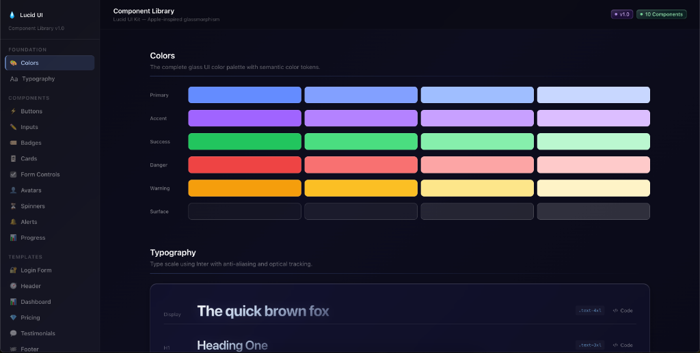

# 💧 Lucid UI

A high-fidelity, premium **Glassmorphism Component Library** built for modern web applications. Inspired by Apple's design language, Lucid UI focuses on sweeping refractions, animated gradients, and cinematic backdrop blurs to create deep, immersive user interfaces.



## ✨ Key Features

- **Premium Glassmorphism**: Optimized `backdrop-filter` and `saturate` combinations for a hyper-realistic glass effect.
- **Animated Gradients**: Dynamic "shimmering" card effects that react to interaction.
- **Cinematic Light Leaks**: Ambient radial glows and orb animations that bring layouts to life.
- **Component Library**: Includes Login Pages, Dashboards, Pricing Tables, Social Proof (Testimonials), and more.
- **Fully Responsive**: Built with Tailwind CSS for seamless viewing across all device sizes.
- **Interactivity**: Powered by Framer Motion for buttery-smooth entrance and hover animations.

## 🛠️ Technology Stack

- **Core**: [React](https://reactjs.org/) + [Vite](https://vitejs.dev/)
- **Styling**: [Tailwind CSS](https://tailwindcss.com/)
- **Animations**: [Framer Motion](https://www.framer.com/motion/)
- **Icons**: [Lucide React](https://lucide.dev/) + Droplet Emoji Branding

## 🚀 Getting Started

### Prerequisites

- Node.js (v18 or higher)
- npm or yarn

### Installation

1. **Clone the repository**
   ```bash
   git clone https://github.com/ItkalNagaratna/lucid-ui.git
   cd glassUI
   ```

2. **Install dependencies**
   ```bash
   npm install
   ```

3. **Start the development server**
   ```bash
   npm run dev
   ```

## 📂 Project Structure

- `src/components/ui/` - Atomic UI components (Buttons, Inputs, Cards, etc.)
- `src/pages/UIKit.jsx` - The central documentation and showcase for the component library.
- `src/pages/LoginPage.jsx` - A production-ready, cinematic login experience.
- `src/index.css` - Global design tokens and glass-text utilities.

## 📄 License

This project is licensed under the MIT License - see the [LICENSE](LICENSE) file for details.

---

Built with ❤️ by the Lucid UI Team.
